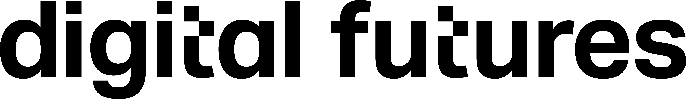

<meta name="og:description" content="KTH hosts the Academic Nordic Blockchain Workshop side event for Nordic Blockchain Week. Check out our link to know more!">
<meta property="og:url" content="https://chains.proj.kth.se/academic-nordic-blockchain-workshop-2">
<meta property="og:image" content="https://avatars.githubusercontent.com/u/104410944?s=200&v=4">

# The Academic Nordic Blockchain Workshop KTH 2026

Welcome to the KTH Academic Nordic Blockchain Workshop, a side event of [Nordic Blockchain Week 2026](https://www.nordicblockchain.com/conference-2026).

The goal of the event is to provide a forum for researchers and practitioners who are advancing blockchain technology. 

* Location: KTH, room TBD
* Date: May 25th, 2026
* Time:16h-19h
* Registration is free of charge but compulsory for the sake of fika planning. [Register Here 😄](https://www.kth.se/form/69b14228fa8f3c4d8d2cd18e)
* Luma event: [https://luma.com/tl38svz5](https://luma.com/tl38svz5)

## Program
TBD

**Would you like to speak?** Please reach out to sofbob@kth.se 

## Sponsors

   

## Previous editions
- [The Academic Nordic Blockchain Workshop KTH 2025](https://chains.proj.kth.se/academic-nordic-blockchain-2025)
