# Dependency Resolution in Different Ecosystems

The post discusses how different package managers resolve dependencies while for building.

## Maven

[Maven](https://maven.apache.org/) is a build tool for building Java projects.
It defines dependencies in terms of three attributes - `groupId`,
`artifactId`, and `version`.
For
example, [`io.github.chains-project:collector-sahab:0.5.3`](https://mvnrepository.com/artifact/io.github.chains-project/collector-sahab/0.5.3),
is a maven dependency where `groupId` is `io.gihub.chains-project`,
`artifactId` is `collector-sahab`, and version is `0.5.3`.
So, when a project is built, Maven resolves the dependencies by looking for
these attributes.

However, if there are more than one dependency with same `groupId` and
`artifactId`, it keeps only one version of that dependency.
It decides the version to keep based on the following algorithm.

1. Choose dependency at the minimum depth in the dependency 
   tree with respect to the project.
2. If depth is same, the first sibling is selected.

Let's consider an example.
The following graph is dependency tree of a project, and we resolve
dependency `Dx` based on the above resolution algorithm.
Note that the tree is ordered.
`D1`, `D2`, `D3`, and `D4` are declared in an order and the tree reflects it
by showing it left to right.

First, we find out the minimum depth of `Dx`.
It is `2` in the branch of `D2` and `D4`.
So it has to be either `Dx v1.2.0` or `Dx v1.5.0`.

Then, we select the first sibling.
Based on this tree, it is `Dx v1.2.0` because it appears first in the tree
if we scan the tree left to right.
Thus, `Dx` is resolved to `v1.2.0`.

## Go

To manage dependencies, Go uses _Modules_.
In Go, a module is identified by its _module path_ and a _version_.
A module used as a dependency is recorded in the `go.mod` file.
For instance `github.com/BurntSushi/toml v1.3.2`, where `github.com/BurntSushi/toml` is the module path, and `v1.3.2` is the version (semver).

To resolve the modules which are to be included in a build, it uses an algorithm called [Minimal Version Selection (MVS)](https://research.swtch.com/vgo-mvs) to generate a _build list_.
For dependency resolution, we only need to understand the first step in this algorithm i.e. - [Construct Build List](https://research.swtch.com/vgo-mvs#algorithm_1)

Consider the above dependency graph as an example.

To determine which modules make the build list, it looks into the `go.mod` files of both the main module and its dependencies, and traverses the graph of all reachable modules/versions.
During this traversal, a _rough list_ is created. The rough list will contain all reached modules. In our example: \[`D1`, `D11`, `Dx v1.0.0`, `D2`, `Dx 1.2.0` `D3`, `D31`, `D311`, `Dx v1.3.0`, `D4`, `Dx v1.5.0`\].

The rough list is then simplified, by keeping only the newest version of any listed module.
Hence, `Dx` which has the highest `semver` version is selected and that is `Dx v1.5.0`.

By following this algorithm, the build list is guaranteed to include the oldest module versions available that meet the requirements, thus achieving reproducible behavior.
