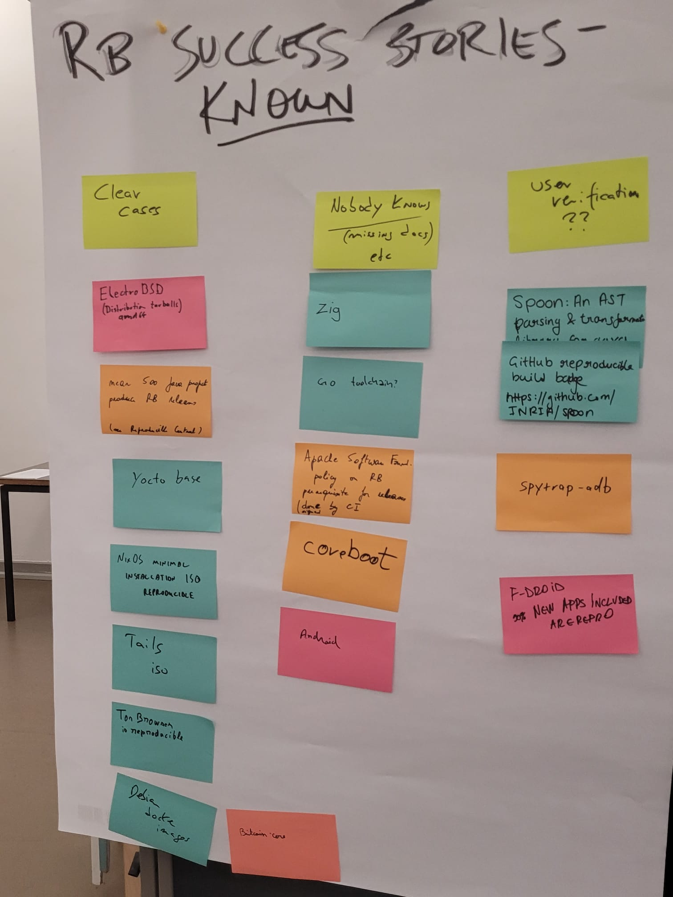
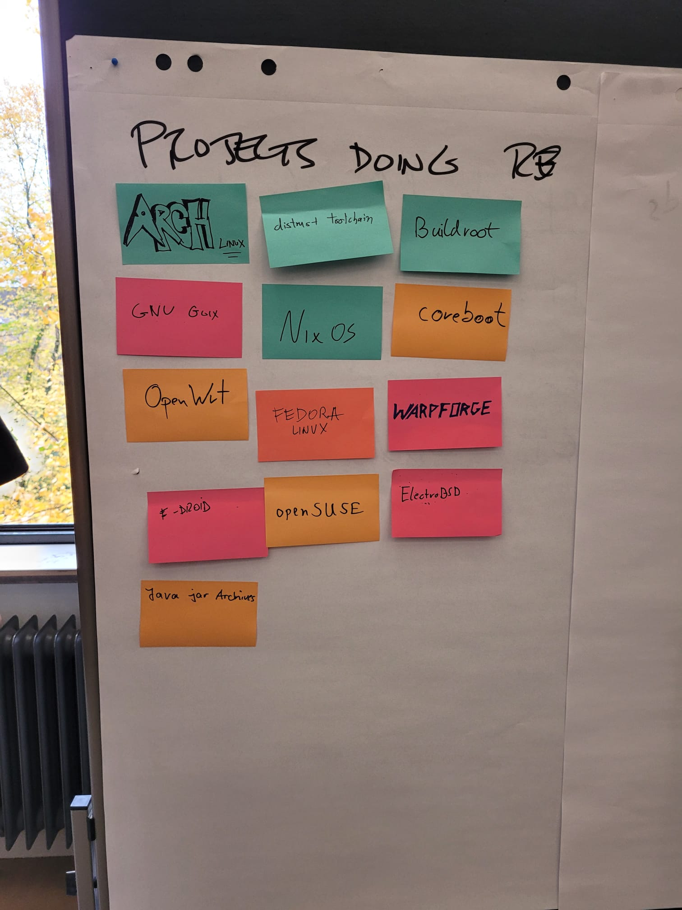
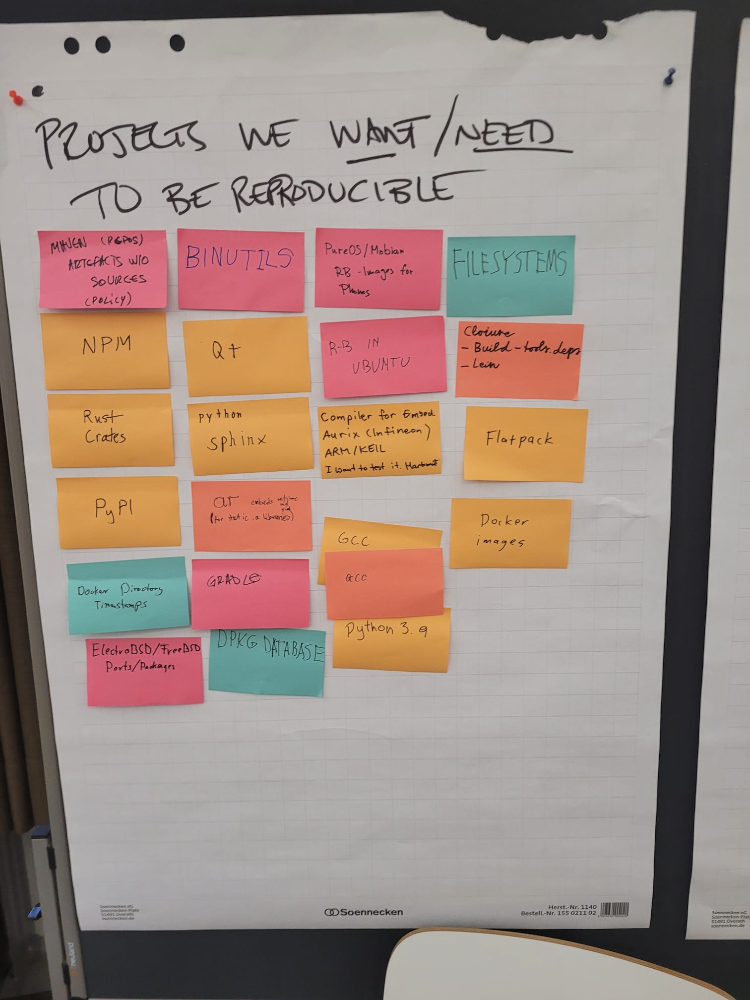

# Reproducible Builds Summit 2023
 
Reproducible Builds 2023 was held in Hamburg, Germany this year.
Aman Sharma from Chains attended the summit to understand the state-of-the-art in reproducible
software builds, and to meet with other researchers and engineers working on
it.

## What are reproducible builds?

A build is reproducible if given the same source code, build environment and
build instructions, any party can recreate *bit-by-bit* identical copies of all
specified artifacts. Reference: <https://reproducible-builds.org/docs/definition/>

For example, let's consider maven artifact `fr.inria.gforge.spoon:spoon-core:10.4.2`.
The arficat is hosted on [maven central](https://repo1.maven.org/maven2/fr/inria/gforge/spoon/spoon-core/10.4.2/).
The source code of this artifact is available on
[GitHub](https://github.com/INRIA/spoon/).

If we can prove that the artifacts hosted on maven central are bit-by-bit
identical to the artifacts we build from the source code, then we can be sure
that the artifacts hosted on maven central are the same as the artifacts we
build from the source code.

[Reproducible Central](https://github.com/jvm-repo-rebuild/reproducible-central/blob/master/content/fr/inria/gforge/spoon/spoon-core/README.md)
checks exactly that and it indeed reports that the artifacts are reproducible.

## Why does it matter?

Free software source code is available for anyone to read.
However, most software is distributed as binaries. We implicty trust the binary if we trust
the source code.
Ensuring that the binaries are *actually* built from the source code is, thus, an
important problem as it is possible that the compilation process could have
introduced some backdoors or other malicious code. Reproducible builds are a
way to ensure that the binaries are built with no deviations from the trusted
source code. Reference: <https://reproducible-builds.org/>

## Activities at the summit

The summit was held over three days with the agenda building as the participants
suggested topics. The topics were discussed in small groups and the discussions
were summarized at the end of the day. All the notes are available
[here](https://reproducible-builds.org/events/hamburg2023/agenda/). Along
with discussions, there were also hands-on sessions where participants engaged
in coding activities.

There were three activities that Aman was involved in and here is the summary of
each of them:

### Mapping the big picture

The goal of this activity was to understand where things stand in status-quo.
We were asked to put thoughts on a post-it note and stick it under the
the following questions:

1. Projects that we know are 100% reproducible
2. Projects trying to be reproducible
3. Projects that have not show any indication of being reproducible, but we
    want them to be reproducible.





The key takeaways from these post-it notes were:

1. 100% reproducible projects: ElectroBSD, TailsISO, Tor Browser, Bitcoin core,
    NixOS minimal installation ISO. See the full list [here](https://reproducible-builds.org/events/hamburg2023/success-stories/)
2. Projects that are almost there: Debian, Arch Linux, NixOS. See the full list [here](https://reproducible-builds.org/events/hamburg2023/infra/)
3. Some projects we want to be reproducible: Ubuntu, Gradle, GCC, Python3.9. See the full list
    [here](https://reproducible-builds.org/events/hamburg2023/projects/).


### Reproducing GO toolchain

The goal of this hands-on activity was to reproduce the GO toolchain as
it is claimed [here](https://go.dev/blog/rebuild). Aman met someone there who
also shared this interest, so worked together on this.

We first tried to follow instructions to [build from source](https://go.dev/doc/install/source).
However, we were not able to reproduce the binaries. Then it was decided to reverse engineer
[gorebuild](https://pkg.go.dev/golang.org/x/build/cmd/gorebuild)
(tool to verify reproducibility of GO toolchain) to understand how it works.

We saw that it downloaded the source and the binary from https://go.dev/dl/
and then stripped the signature from the binary and then compared the checksum.
**Indeed, the unsigned binaries were reproducible at least on MacOS**.
My hands-on session partner pushed all artifacts to a [GitHub repo](https://github.com/kommendorkapten/reprogo).
It has 4 artifacts:
1. go-0: Locally built and signed
2. go-1: Upstream binary, signed by google
3. go-stripped-0: Local built binary, signature stripped
4. go-stripped-1: Google built binary, signature stripped

```sh
diff go-stripped-0 go-stripped-1
```
returned with exit code 0, which means that the binaries are bit-by-bit identical.


### Born Reproducible

The goal of this activity was to prepare a framework so that new projects can
start being reproducible from the beginning. The idea was to have a checklist.
It evolved over three meetings:

1. [Born Reproducible I](https://reproducible-builds.org/events/hamburg2023/born-reproducible-1/)
2. [Born Reproducible II](https://reproducible-builds.org/events/hamburg2023/born-reproducible-2/)
3. [Born Reproducible III](https://reproducible-builds.org/events/hamburg2023/born-reproducible-3/)

The 8 step checklist is as follows:

**Step 0:** Have a clean and defined build environment.

**Step 1:** Know and define *input* and *output*.

**Step 2:** Record build metadata (eg. buildinfo).

**Step 3:** Try to rebuild in a similar environment.

**Step 4:** Analyse any differences.

**Step 5:** Try to rebuild in a different enviroment.

**Step 6:** Make it possible for users to rebuild/validate.

**Step 7:** Define policy if build is unreproducible.

**Step 8:** Announce reproducibility!

> It slightly differs from what is linked because there were steps that were
related to deployment. I have removed those steps here.

The last meeting (Born Reproducible III) in this series was about seeing how
this framework applies to Maven projects. We took inspiration from
[Reproducible Central](https://github.com/jvm-repo-rebuild/reproducible-central)
to build concrete steps based on the above checklist.

**Step 0:** Assumes GitHub action runner as clean environment.

**Step 1:** Inputs:
- Java source code
- A minimal `pom.xml`. If it is from a boilerplate code, the developer must
refine it.

    Outputs:
- Compare the all artifacts.
> [`.buildspec`](https://github.com/jvm-repo-rebuild/reproducible-central/blob/master/content/fr/inria/gforge/spoon/spoon-core/spoon-core-10.4.2.buildspec)
and
[`.buildinfo`](https://github.com/jvm-repo-rebuild/reproducible-central/blob/master/content/fr/inria/gforge/spoon/spoon-core/spoon-pom-10.4.2.buildinfo)
takes care of it in Reproducible Central.

**Step 2:** It is not relevant for Java.

**Step 3:** First build with `mvn package` can have network access, but the 
second build should be done air-gapped.

**Step 4:** Reproducible Central uses
[`diffoscope`](https://diffoscope.org/).

**Step 5:** It is not relevant for Java as JVM follows
[Write Once Run Anywhere](https://en.wikipedia.org/wiki/Write_once,_run_anywhere).

**Step 6:** There is no standardized way that a developer could provide so
that the users could reproduce easily.
Reproducible Central uses a 
[self-written script](https://github.com/jvm-repo-rebuild/reproducible-central/blob/master/rebuild.sh).

**Step 7:** It was not very relevant since maven central stores
[detached signature](https://en.wikipedia.org/wiki/Detached_signature).

**Step 8:** Again, no standard way to annouce reproducibility, but having
README badges help. For example,

in `spoon-core`.

## Key takeaways

From the activities above,
- Good to know [so many different](#mapping-the-big-picture)
projects are supporting reproducible builds.
- Reproducing `go` was not straightforward. We could not do it manually and
using a tool may have masked a lot of intricacies.
- A good starting point for reproducibility is to have third-party builders
to monitor reproducibility like Reproducible Central.

From the overall summit,

- Reproducible Builds is hard for packages and harder for complete operating systems.
- [12 ways](https://reproducible-builds.org/events/hamburg2023/rb-commandments/)
to avoid unreproducible builds.
- Great event to meet people who love software supply chain!

--Aman

<p align="center">~~Fin~~</p>
