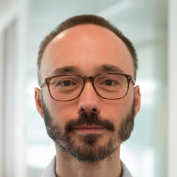
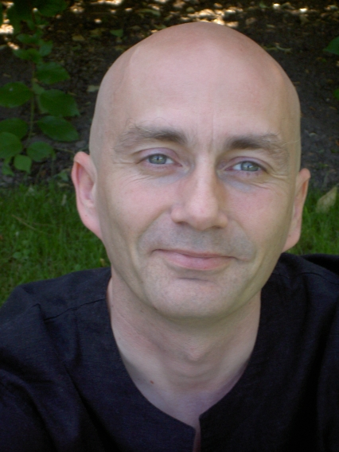

# 2nd KTH Workshop on the Software Supply Chain

    

Welcome to the 2nd KTH Workshop on the Software Supply Chain. This workshop is organized in the context of the [CHAINS](https://chains.proj.kth.se/) research project.

* Location: [U51, Brinellvägen 26](https://www.kth.se/places/room/id/d7857e8e-4729-481f-8aba-9f2c167d1937?l=en), KTH Royal Institute of Technology (Main campus)
* Date: April 21, 2023  
* Time: 9h-17h  
* Registration is free and compulsory for sake of lunch/fika planning: [Registration form](https://www.kth.se/form/641b0b4cba29878959f79037) (CLOSED)

## Program

<table class="tg">
<thead>
  <tr>
    <th class="tg-c3ow">Time</th>
    <th class="tg-c3ow">Event</th>
  </tr>
</thead>
<tbody>
  <tr>
    <td class="tg-c3ow">0900</td>
    <td class="tg-c3ow">Introduction</td>
  </tr>
  <tr>
    <td class="tg-c3ow">0930</td>
    <td class="tg-c3ow">Keynote "End User Supply Chain Attacks and Defenses", by <a href="http://collberg.cs.arizona.edu/">Christian Collberg</a> (<a href="https://drive.google.com/file/d/1uH5YhnhbwfEoLEGZBHjsHrhxv_ixwqXK/view?usp=drive_web">slides</a>)</td>
  </tr>
  <tr>
    <td class="tg-c3ow">1030</td>
    <td class="tg-c3ow">Break</td>
  </tr>
  <tr>
    <td class="tg-c3ow">1100</td>
    <td class="tg-c3ow">"A (slightly) Wider View on Software Supply", <a href="https://www.linkedin.com/in/matsolajonsson/">Mats Jonsson</a> (SEB)</td>
  </tr>
  <tr>
    <td class="tg-c3ow">1130</td>
    <td class="tg-c3ow">
        "<a href="https://arxiv.org/abs/2303.11102">Challenges of Producing Software Bill Of Materials for Java</a>" by <a href="https://www.kth.se/profile/amansha">Aman Sharma</a>, Martin Wittlinger, et al (KTH)
        (<a href="https://docs.google.com/presentation/d/1AyadF95Xdbz3mU7IWbAwGm0pgUtXe6j_Bc3Lo_kCeFc/edit?usp=sharing">slides</a>)
         
    </td>
  </tr>
  <tr>
    <td class="tg-c3ow">1200</td>
    <td class="tg-c3ow">Lunch</td>
  </tr>
  <tr>
    <td class="tg-c3ow">1400</td>
    <td class="tg-c3ow">Keynote "Building Blocks for a Safe(r) Open Source Software Supply Chain: Reproducible Builds and Software Heritage", by <a href="https://upsilon.cc/~zack/">Stefano Zacchiroli</a> (<a href="https://upsilon.cc/~zack/talks/2023/2023-04-21-kth-chains.pdf">slides</a>)</td> 
  </tr>
  <tr>
    <td class="tg-c3ow">1500</td>
    <td class="tg-c3ow">Fika</td>
  </tr>
  <tr>
    <td class="tg-c3ow">1530</td>
    <td class="tg-c3ow">
      "<a href="https://www.monperrus.net/martin/slides-supply-chain-crypto.pdf">The Software Supply Chain of Crypto and Decentralization</a>" by <a href="https://www.monperrus.net/martin/">Martin Monperrus</a>  (KTH)
         
        
    </td>
  </tr>
  <tr>
    <td class="tg-c3ow">1600</td>
    <td class="tg-c3ow">Talk by <a href="https://www.linkedin.com/in/markstrande/">Mark Strande</a> (Klarna)</td>
  </tr>
  <tr>
    <td class="tg-c3ow">1630</td>
    <td class="tg-c3ow">Closing</td>
  </tr>
</tbody>
</table>

## Keynote speakers

### [Stefano Zacchiroli](https://upsilon.cc/~zack/)

**Building Blocks for a Safe(r) Open Source Software Supply Chain:Reproducible Builds and Software Heritage**

<ins>Abstract</ins>

Securing the software supply chain, in particular when it comes to its
free/open source software (FOSS) components, is all the rage now.
Applied researchers, industry consortia, and practitioners alike are
trying out a variety of approaches looking for the ones that will
stick. In this talk we will review two building blocks for a safe(r)
FOSS supply chain that are seeing significant adoption.

On the one hand Reproducible Builds [\[1\]](https://reproducible-builds.org/) enables
downstream users of FOSS products, whose source code they trust, to establish trust in
binary versions of the same products built by untrusted 3rd parties.
On the other hand Software Heritage [\[2\]](https://www.softwareheritage.org/) has
assembled the largest public archive of software source code a version control system
information, providing traceability at the scale of public source code
with strong integrity guarantees.

[1] [https://reproducible-builds.org/](https://reproducible-builds.org/)

[2] [https://www.softwareheritage.org/](https://www.softwareheritage.org/)

<ins>Speaker Bio</ins>

Stefano Zacchiroli is full professor of computer science at Télécom
Paris, Polytechnic Institute of Paris. His current research interests
span digital commons, open source software engineering, computer
security, and the software supply chain. He is co-founder and CTO of
Software Heritage, the largest public archive of software source code.
He is a Debian developer since 2001, where he served as Debian project
leader from 2010 to 2013, and a member of the Reproducible Builds
steering committee. He is a former board director of the Open Source
Initiative (OSI) and recipient of the 2015 O’Reilly Open Source Award.

### [Christian Collberg](http://collberg.cs.arizona.edu/)

**End User Supply Chain Attacks and Defenses**

<ins>Abstract</ins>

In this talk, we will discuss supply chain attacks that occur at two particular points of the chain. First, we will consider attacks by compromised build tools (i.e. perpetrated by the tool author), and second, attacks that occur at the end of the chain, i.e perpetrated by application end-users. We will then consider Software Protection algorithms that can mitigate such attacks, including diversification, watermarking, tamperproofing, and obfuscation. Finally, we will discuss the design and use of the Tigress software protection tool.

<ins>Speaker Bio</ins>

Christian Collberg is a Professor and Interim Head of Department in the Department of Computer Science at the University of Arizona. His main research interest is computer security, in particular the so-called Man-At-The-End Attack which occurs in settings where an adversary has physical access to a device and compromises it by tampering with its hardware or software. He received his PhD from Lund University, Sweden, and, prior to moving to Arizona, taught for 5 years at the University of Auckland, New Zealand. He is the author of the first comprehensive textbook on software protection, "Surreptitious Software: Obfuscation, Watermarking, and Tamperproofing for Software Protection" and the premier open software protection tool, "Tigress" ([https://tigress.wtf](https://tigress.wtf)).
