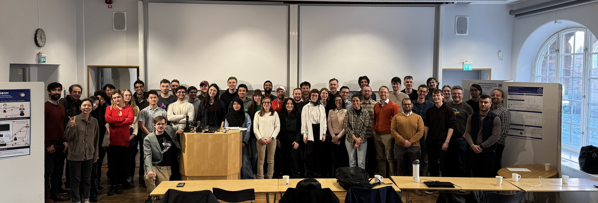
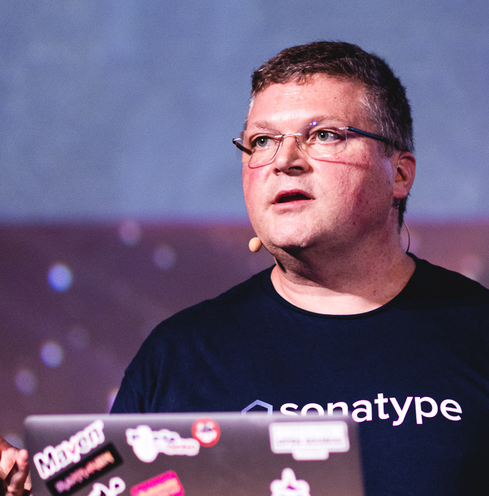
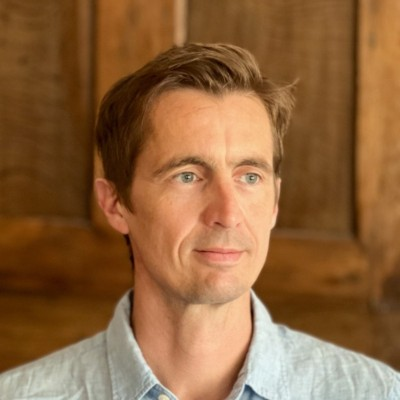

<meta name="og:description" content="KTH hosts the 4th CHAINS workshop where we have conversations about super cool research on software supply chain security and reliability.">
<meta property="og:url" content="https://chains.proj.kth.se/software-supply-chain-workshop-4">
<meta property="og:image" content="https://avatars.githubusercontent.com/u/104410944?s=200&v=4">

# 4th KTH Workshop on the Software Supply Chain 2025

    

Welcome to the 4th KTH Workshop on the Software Supply Chain in Stockholm, Sweden.
This workshop is organized in the context of the [CHAINS](https://chains.proj.kth.se/) research project.

* Location: KTH, Stockholm, Sweden, [Salongen, KTH library](https://www.kth.se/places/room/id/2ce773d5-3190-4588-8618-27ea2822000b)
* Date: Friday 25 April, 2025
* Time: 9h-17h

## Program

| Time  | Event                                                                                       |
|-------|---------------------------------------------------------------------------------------------|
| 0830  | Welcome coffee                                                                              |
| 0900    | Opening (Martin Monperrus)                                                                |
| 0915  | Keynote: Software Supply Chain: Signature vs Attestations vs [Reproducible Builds](https://github.com/jvm-repo-rebuild/reproducible-central), Hervé Boutemy (Sonatype, Apache Software Foundation)                               |
| 1015 | Break + Poster session                                                                      |
| 1100   | (duration 15+5 minutes each)                                                            |
|       | * Julien Malka, [Does Functional Package Management Enable Reproducible Builds at Scale? Yes](https://hal.science/hal-04913007) |
|       | * Aman Sharma, Causes and Mitigations of Unreproducible Builds in Java [(slides)](https://algomaster99.github.io/talks/4th-chains-workshop/slides.pdf)                                                    |
|       | * Tina Heidinger (Github), Fredrik Skogman (GitHub), [Github Attestations](https://docs.github.com/actions/security-guides/using-artifact-attestations-to-establish-provenance-for-builds) ([slides](workshop_4_assets/slides/github_update.pdf))            |
|       | * Frank Reyes, Fixing Breaking Dependency Updates Using LLMs [(slides)](workshop_4_assets/slides/4th_KTH_Chain_2025_Frank_Reyes.pdf)                        |
| 1230 | Lunch at Syster-o-bror                                                                      |
| 1400   | Keynote: [Two Steps Forward, One Step Back: The Slow March of Software Supply Chain Security](https://chains.proj.kth.se/workshop_4_assets/slides/20250425_Henrik_PLATE_Keynote_CHAINS_Workshop.pdf), Henrik Plate (Endor Labs)                                                          |
| 1500  | Break                                                                                       |
| 1530 | Tool session (duration 10+5 minutes each)
|       | Chair: Frank Reyes
|       | * [maven-lockfile](https://github.com/chains-project/maven-lockfile/), Lockfiles for Java and Maven (Elias Lundell) ([slides](workshop_4_assets/slides/maven-lockfile-presentation.pdf))     |
|       | * [observer](https://github.com/sbom-observer/observer-cli), Generating SBOMs for C/C++ (Andreas Bielk) ([slides](workshop_4_assets/slides/high-quality-sboms-cpp.pdf))       |
|       | * [dirty-waters](https://github.com/chains-project/dirty-waters), Transparency checks for SSC (Raphina Liu)                           |
|       | * [ghasum](https://github.com/chains-project/ghasum), GitHub Action Integrity (Eric Cornelissen) ([slides](workshop_4_assets/slides/ghasum-presentation.pdf))|
| 1645 | Announcing the winner of the [CHAINS competition](https://chains.proj.kth.se/chains-repo-checklist.html)                                                                                      |
| 1655 | Closing                                                                                     |

## Talks

### Trust in Software Supply Chain: Signature vs Attestations vs Reproducible Builds

[Hervé Boutemy (Sonatype \| Apache Software Foundation)](https://www.linkedin.com/in/hboutemy/?originalSubdomain=fr)

<u>Speaker Bio</u>

Hervé started with Java when it was in beta, built his first Java projects with Make (yes) then Ant: but life changed with Maven 1... Life changed even more when growing from OSS user during working day to becoming an active OSS contributor to Maven 2 during nights and week-ends.
Today, Hervé works as Solutions Architect for Sonatype on next steps of the build journey, promoting best-practices around Software Supply Chains.
On the OSS front, Hervé is an Apache Software Foundation member and Apache Maven PMC Chair. He's also involved in many advanced projects like CycloneDX, SPDX, sigstore, or Reproducible Builds, where he is learning new supply chain technologies by implementing them with Maven.

### Two Steps Forward, One Step Back: The Slow March of Software Supply Chain Security

[Henrik Plate (Endor Labs)](https://linkedin.com/in/henrikplate)

<u>Speaker Bio</u>

Henrik Plate is the principal security researcher at Endor Labs. He formerly worked for SAP Security Research, where he established and led the focus topic “Open Source Security” starting 2014. He co-authored several academic papers on this topic, presented at academic and industry conferences like the RSA, is the project lead and core-developer of Eclipse Steady (an open source solution using program analysis techniques to assess the exploitability of vulnerabilities), and contributes to the Risk Explorer for Software Supply Chains (an open source solution to understand supply chain threats and safeguards).
He earned his PhD in 2024 from the University of Rennes, France, with a thesis titled “On the Security Risks of Open Source Consumption: Vulnerabilities and Supply Chain Attacks in the Era of Open-Source-Based Software Development”. He received his MSc in Computer Science and Business Administration in 1999 from the University of Mannheim, Germany, and holds a CISSP certification.

## Poster session

List of posters:
* [Classport: Which dependency is currently running in your Java project?](workshop_4_assets/posters/classport.pdf) by Serena Cofano
* [DDC4j: Diverse Double Compilation 4 Java](workshop_4_assets/posters/ddc4j.pdf) by Eskil Nyberg, Elias Lundell
* [DepsRAG: Towards Agentic Reasoning and Planning for Software Dependency Management](workshop_4_assets/posters/DepsRAG.pdf) by Mohannad Alhanahnah
* [Diverse Double-Compiling in a CI/CD environment](workshop_4_assets/posters/ddc4cd.pdf) by Ludvig Christensen
* [Is Your Software Supply Chain Secure?](workshop_4_assets/posters/Is%20Your%20Software%20Supply%20Chain%20Secure.pdf) by Shivaswaroop N K
* [Towards Reliable Dependency Management](workshop_4_assets/posters/towards_reliable_dependency_management.pdf) by Cathrine Paulsen
* [Vexed by VEX tools: Consistency evaluation of container vulnerability scanners](workshop_4_assets/posters/vex.pdf) by Yekatierina Churakova
* [zkSBOM](workshop_4_assets/posters/zkSBOM.pdf) by Tom Sorger

## Winner of [Software Supply Chain competition](chains-repo-checklist.md)

<strong>Martin Schwaighofer &#129321;</strong>
  
<iframe width="560" height="315" src="https://www.youtube.com/embed/lqH2lVe8Isc?si=SnYyDkyq4Esrmb30" title="YouTube video player" frameborder="0" allow="accelerometer; autoplay; clipboard-write; encrypted-media; gyroscope; picture-in-picture; web-share" referrerpolicy="strict-origin-when-cross-origin" allowfullscreen></iframe>

## Sponsors

  

## Previous editions

- [3rd KTH Workshop on the Software Supply Chain](/software-supply-chain-workshop-3.md)
- [2nd KTH Workshop on the Software Supply Chain](/software-supply-chain-workshop-2.md)
- [1st KTH Workshop on the Software Supply Chain](/software-suppply-chain-workshop-1.md)
