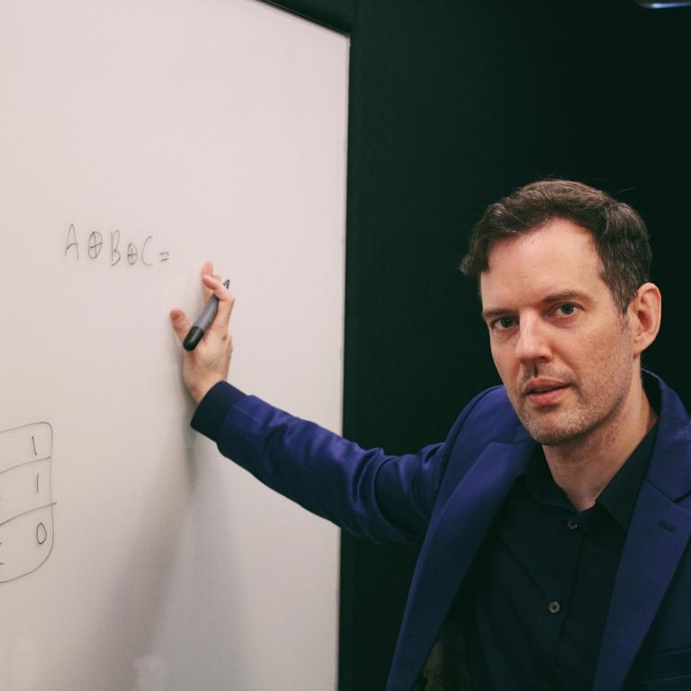

<meta name="og:description" content="KTH hosts the 5th CHAINS workshop where we have conversations about super cool research on software supply chain security and reliability.">
<meta property="og:url" content="https://chains.proj.kth.se/software-supply-chain-workshop-5">
<meta property="og:image" content="https://avatars.githubusercontent.com/u/104410944?s=200&v=4">

# 5th KTH Workshop on the Software Supply Chain 2026

Welcome to the 5th KTH Workshop on the Software Supply Chain in Stockholm, Sweden.
This workshop is organized in the context of the [CHAINS](https://chains.proj.kth.se/) research project.

* Location: KTH, Stockholm, Sweden, [Salongen, KTH library](https://www.kth.se/places/room/id/2ce773d5-3190-4588-8618-27ea2822000b)
* Date: Friday 24th April, 2026
* Time: 9h-17h30
* Registration is free and compulsory for sake of lunch/fika planning: [Registration form](https://www.kth.se/form/698077d8a336ea0c04afe556).

## Program

| Time  | Event                                                                                       |
|-------|---------------------------------------------------------------------------------------------|
| 8h30   | Welcome coffee |
| 9h   | Opening (XX) |
| 9h15 | Justin Cappos, SBOMs Are No Longer Mandatory Which Is A Good Thing" and Other Opinionated Software Supply Chain Observations |
|10h15 | break + poster |
| 10h45   | Peter Andersson, "Chainguard, the safe source for open source", Chainguard |
| 11h15   | Olle E. Johansson, "The Open Source community prepares for the CRA. Where’s the industry?", Edvina |
| 11h45   | Niels Möller, "The Sigsum transparency system", Glasklar Teknik AB  |
| 12h15   | Lunch |
| 14h   | Andrew Nesbitt, "TBD", Ecosyste.ms |
| 14h30   | Cesar Soto-Valero, "TBD", SEB Group |
| 14h45   | Mojtaba Moazen, "TBD", KTH Royal Institute of Technology |
| 15h15   | Break + poster |
| 15h45   | Chains PhD Festival (5min per Chains PhD student)
| 16h15   |  Musard Balliu, "TBD", KTH Royal Institute of Technology |
| 17h   |  Closing (XX)  |

## Keynote

### "SBOMs Are No Longer Mandatory Which Is A Good Thing" and Other Opinionated Software Supply Chain Observations, _by_ [Justin Cappos](https://engineering.nyu.edu/faculty/justin-cappos), New York University

<ins>Abstract</ins>: Software supply chain security has moved from a niche problem to a critical part of modern software infrastructure.  However, that does not mean that it is well understood overall.  This keynote focuses on a number of common misconceptions about security in the software supply chain.  I will take a position on topics such as "Security might improve now that SBOMs are no longer mandated", "Integrating Sigstore provides less protection against compromise than you might expect", "Signing software updates with Notation or similar technologies provides little security benefit", "Signing Git commits provides only small security value in practice", and "Reproducible builds are a religion (not a science), but you should join!".  Pointed questions / rebuttals from the audience are welcome!

<ins>Speaker Bio</ins>: Justin Cappos is a professor in the Computer Science and Engineering Department at New York University. He is a creator of a variety of widely used software supply chain technologies, including TUF, Uptane, gittuf, and in-toto. Working with his collaborators, he has also contributed to security architectures used in Git, reproducible builds, major Linux package managers, popular programming language ecosystems, legal repositories, automobiles, and more. Due to the depth and breadth of these contributions — along with, perhaps, a few gray hairs — he is, to his surprise, sometimes given the moniker “father of software supply chain security".

## Poster session

List of posters:

TBD

## Sponsors

## Previous editions

- [4th KTH Workshop on the Software Supply Chain](/software-supply-chain-workshop-4.md)
- [3rd KTH Workshop on the Software Supply Chain](/software-supply-chain-workshop-3.md)
- [2nd KTH Workshop on the Software Supply Chain](/software-supply-chain-workshop-2.md)
- [1st KTH Workshop on the Software Supply Chain](/software-suppply-chain-workshop-1.md)

